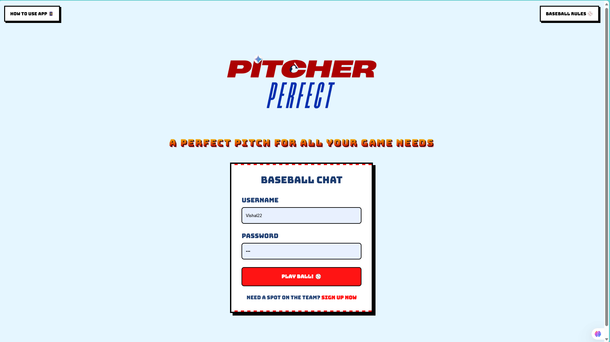
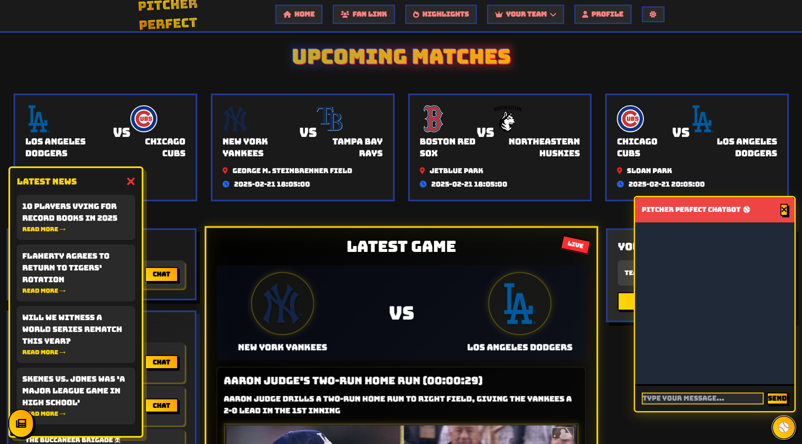

<div align="center">
  
  
  # Pitcher Perfect
  ### Your AI-Powered Baseball Companion
  
  [](https://flask.palletsprojects.com/)
  [](https://cloud.google.com/)
  [](https://www.mlb.com/)
</div>

## 🎯 Project Overview

Watch our project demo: [Pitcher Perfect Demo](https://youtu.be/-ELvMqja4uw?si=JhBT3p2oq5kUMwl9)

Pitcher Perfect revolutionizes how baseball fans experience the game through AI-powered personalization and real-time engagement. Built with cutting-edge technology, it delivers customized highlights, interactive features, and seamless multilingual support.

<!-- <div align="center">
  
</div> -->

## ⚡ Key Features

### 🎮 User Experience
- Personalized onboarding with smart questionnaire
- AI-generated welcome emails and insights
- Real-time game updates and highlights
- Interactive team builder and comparison tools

### 💬 Social Features
- In-app chat with fellow baseball enthusiasts
- Join baseball fan leagues
- Group discussions and match threads
- Share personalized game insights

### 🤖 AI Integration
- Gemini 2.0 powered game summaries
- Multilingual support (English, Spanish, Japanese,Hindi,Korean,German,French)
- Smart notifications for favorite teams/players
- AI-driven match analysis

## 🛠️ Technical Stack

- **Backend**: Flask, Json
- **AI/ML**: Google Cloud AI, Gemini 2.0
- **APIs**: MLB Stats API, Google Translate API
- **Database**: Firebase Realtime Database

## 📁 Project Structure

README.md
pitcher-perfect/ ├── database/ # Database configurations ├── dataset/ # MLB teams dataset ├── features/ # Custom Python modules ├── static/ │ └── images/ # Project images and assets ├── templates/ # HTML templates ├── app.py # Main application file ├── personalisedemailcontent.py └── requirements.txt


## 🔄 API Endpoints

| Endpoint | Description | Preview |
|----------|-------------|---------|
| `/signup` | User registration |  |
| `/login` | User authentication |  |
| `/how-to-use` | Tutorial video |  |
| `/baseball-rules` | Game guidelines |  |
| `/` | Home dashboard |  |
| `/` | Home dashboard translate|  |
| `/chat_dashboard` | Chat overview |  |
| `/chat/<friend>` | Private messaging |  |
| `/group_chat/<group_id>` | Group discussions |  |
| `/team_players` | Team builder |  |
| `/team_players` | Team builder |  |
| `/my_team` | User's team |  |
| `/team_compare` | Team comparison |  |
| `/` | Home dashboard darkmode with news and chatbot |  |


## 🚀 Getting Started

1. Clone the repository:
```bash
git clone https://github.com/vinayak1729-web/pitcherrrPerfect_final.git

Install dependencies:
pip install -r requirements.txt

Set up environment variables:
cp .env.example .env

Run the application:
python app.py

```

### **👥 Contributors**
---
#### **Vinayak Shinde** – Lead Developer  
[](https://www.linkedin.com/in/vinayak-shinde-1aa968223/)

#### **Vishal Mishra** – Lead Developer  
[](https://www.linkedin.com/in/vishal-mishra-9b2a48208/)

---

### **🚀 Team: Suryaprabha**  
<a href="https://www.linkedin.com/company/surya-prabha-india">
  
</a>  

[🌐 Suryaprabha LinkedIn](https://www.linkedin.com/company/surya-prabha-india)


📄 License
This project is licensed under the MIT License - see the LICENSE file for details.

🤝 Contributing
Contributions are welcome! Please feel free to submit a Pull Request.


